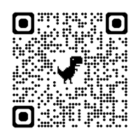

# Give Me a Quote: The Game of Witty Wisdom!

- Author: Mathias Lux
- Date: June 6, 2025

---

Get ready to unleash your inner actor and wordsmith in this fun, fast-paced game of imaginative quotes! **Give Me a Quote** is perfect for **2-16 players** aged **10 and up** looking for a creative challenge.

## What You'll Need

* **Emoji Cards:** Print and cut out the emoji cards you can find at [emojis.hml](emojis.html).
* **Quote Generator:** One computer or smartphone with the webpage https://dermotte.github.io/playing-card-web/src/ open. This will generate your role and topic for each round.
* **Pen & Paper:** Each player needs a pen and a piece of paper to write down their brilliant quotes.

## Getting Started

1.  **Shuffle the Emoji Cards:** Give the emoji cards a good shuffle.
2.  **Deal the Emotions:** Each player gets one emoji card. You can keep your emoji **secret** or show it to everyone – it's up to you! This emoji represents your character's mood or emotion for the round.

## How to Play a Round

### 1. Generate the Prompt

The player whose turn it is (or a designated game master) will "draw a card" on the https://dermotte.github.io/playing-card-web/src/ webpage. This will give everyone a **Role** and a **Topic**.

* **Examples:**
    * "Channel your inner **Agricultural Worker** walking to the fields. Deliver a one-sentence quote on **Golf Carts**."
    * "Role: **Real Estate Agent** showing Properties. Topic: **Hikers**. One-sentence quote please."
    * "As a **Construction Worker**, give us a one-sentence quote on **Motorcycles**."

### 2. Embrace Your Character

Everyone will now embody the *same* **Role** and deliver a quote on the *same* **Topic**. However, your personal emoji card adds a unique emotional twist to your quote! Are you a grumpy construction worker? A joyful real estate agent? Your emoji guides your performance!

### 3. Quoting Time!

* As soon as the prompt is read, you have **30 seconds** to scribble down a single, one-sentence quote on your paper. Remember to infuse your quote with the emotion of your emoji!
* After the 30 seconds are up, each player reads their quote aloud. Get ready for some laughs and creative interpretations!

## Scoring & Winning

1.  **Best Quote Wins!** After all quotes are read, players discuss and vote on which quote was the **best** for that round. Consider how well the quote matched the role, topic, and emoji.
2.  **Keep the Emoji:** The player who gave the winning quote gets to **keep the emoji card** from that round! This is how you track your score.
3.  **New Emoji, New Round:** The winner then draws a *new* emoji card for themselves for the next round.
4.  **Pass the Emotions:** At the end of each round (after the winner is declared), all players (except the winner) **pass their emoji cards clockwise** to the next player. This ensures everyone gets a new emotional challenge each round.

## Game End

Play for a set number of rounds, or until everyone has had a chance to be the game master a few times. The player with the **most emoji cards** at the end of the game is crowned the ultimate **Quote Master**!

## Possible Twists

Consider giving the winners an extra advantage. In an alternative setting, they can choose which of the scored emotions they want to use. So if you won two rounds already, you can choose between the card you've drawn, and the two emojis, you scored. 

---

Ready to give us your best quote?